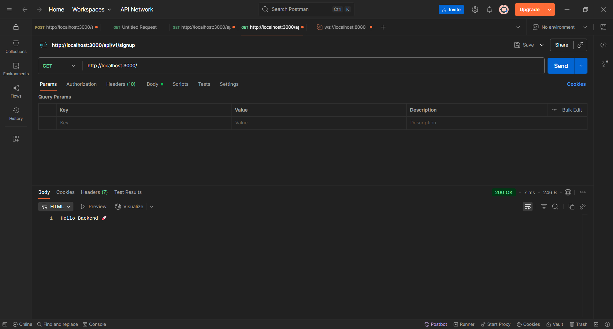

# Day 1 – What is Backend Development?
Welcome to Day 1 of the Backend 101 30-day challenge! This series will guide you from beginner to building production-ready backend systems, no prior experience required.
Today, you’ll explore what backend development is and create your first API using Node.js and Express.js.

## Table of Contents
1. [Theory](#theory)
2. [Setup Instructions](#setup-instructions)
3. [Bonus Challenges](#bonus-challenges)
4. [What You Learned](#what-you-learned)
5. [Next Steps](#next-steps)
6. [Resources](#resources)


## Theory
### What is Backend Development?
Backend development powers the behind-the-scenes parts of web applications. It handles:

- **User requests:** Processing data from the frontend (e.g., a login form).
- **Databases:** Storing/retrieving data (e.g., user profiles).
- **Business logic:** Running rules or calculations (e.g., validating passwords).
- **APIs:** Sending responses to the frontend (e.g., a list of posts).

**In short:** Backend is the engine of your application.

### Frontend vs. Backend
| Aspect         | Frontend                | Backend                   |
|--------------- |------------------------|---------------------------|
| Runs Where     | Browser (client-side)  | Server (server-side)      |
| Tech           | HTML, CSS, JavaScript  | Node.js, Python, Go, etc. |
| Focus          | User interface (UI)    | Data, logic, and APIs     |
| Communication  | Talks to backend via HTTP | Talks to databases and services |

### Backend Architectures

- **Monolithic:** One app with all features (e.g., auth, data, UI logic). Simple to start, harder to scale.
- **Microservices:** Small, independent services (e.g., separate auth and user services). Scalable but complex.

> Note: We’ll start with a monolithic Node.js backend and explore microservices later.

### Backend Languages & Frameworks
Popular stacks:
- **JavaScript/TypeScript:** Node.js + Express/NestJS
- **Python:** Flask, Django
- **Go, Ruby, Java, etc.**

For this series, we’ll use Node.js and Express: beginner-friendly and widely used.

## Setup Instructions
### Prerequisites
- Node.js (v18+ recommended): [Download here](https://nodejs.org/)
- A code editor (e.g., VS Code)
- Optional: Postman for testing APIs: [Download here](https://www.postman.com/downloads/)


### Step 1: Initialize Your Project
Open your terminal and run:

```bash
mkdir day-01-backend-101
cd day-01-backend-101
npm init -y
npm install express
```

### Step 2: Create Your First Server
Create a file named `index.js`:

```js
const express = require('express');
const app = express();

app.get('/', (req, res) => {
  res.send('Hello Backend 🚀');
});

const PORT = 3000;
app.listen(PORT, () => {
  console.log(`Server is running at http://localhost:${PORT}`);
});
```

### Step 3: Run the Server
Run:

```bash
node index.js
```

You should see:

```
Server is running at http://localhost:3000
```

### Step 4: Test Your API
Test your endpoint in one of these ways:

- **Browser:** Open [http://localhost:3000](http://localhost:3000). You should see “Hello Backend 🚀”.
- **Postman:** Send a GET request to [http://localhost:3000](http://localhost:3000) and check the response.
- **Command Line:** Run `curl http://localhost:3000` to see the output.

#### Example Postman Screenshot
Below is a screenshot showing a successful response from the backend using Postman:




## Bonus Challenges
Push yourself further:

**1. Add a `/greet` Route:** Create a route that accepts a query parameter (e.g., `/greet?name=hushhh` → “Hello, hushhh!”):

```js
app.get('/greet', (req, res) => {
  const name = req.query.name || 'stranger';
  res.send(`Hello, ${name}!`);
});
```

Test it at [http://localhost:3000/greet?name=hushhh](http://localhost:3000/greet?name=hushhh).

**2. Use nodemon for Auto-Restart:**


Install nodemon:

```bash
npm install --save-dev nodemon
```

Update `package.json`:

```json
"scripts": {
  "start": "node index.js",
  "dev": "nodemon index.js"
}
```

Run:

```bash
npm run dev
```


**3. Try TypeScript (Advanced):** Convert your server to TypeScript. Install TypeScript and set up `tsconfig.json`:

```bash
npm install --save-dev typescript @types/node @types/express
npx tsc --init
```

See [Express with TypeScript](https://expressjs.com/en/advanced/typescript.html).

## What You Learned
- What backend development is and its role in web apps
- How backend differs from frontend
- Monolithic vs. microservices architectures
- Backend languages and frameworks
- How to:
  - Set up a Node.js project
  - Install and use Express
  - Run a local backend server
  - Create and test basic API routes

## Resources
- [Node.js Documentation](https://nodejs.org/en/docs/)
- [Express.js Guide](https://expressjs.com/)
- [MDN: Client-Server Overview](https://developer.mozilla.org/en-US/docs/Learn/Server-side/First_steps/Client-Server_overview)
