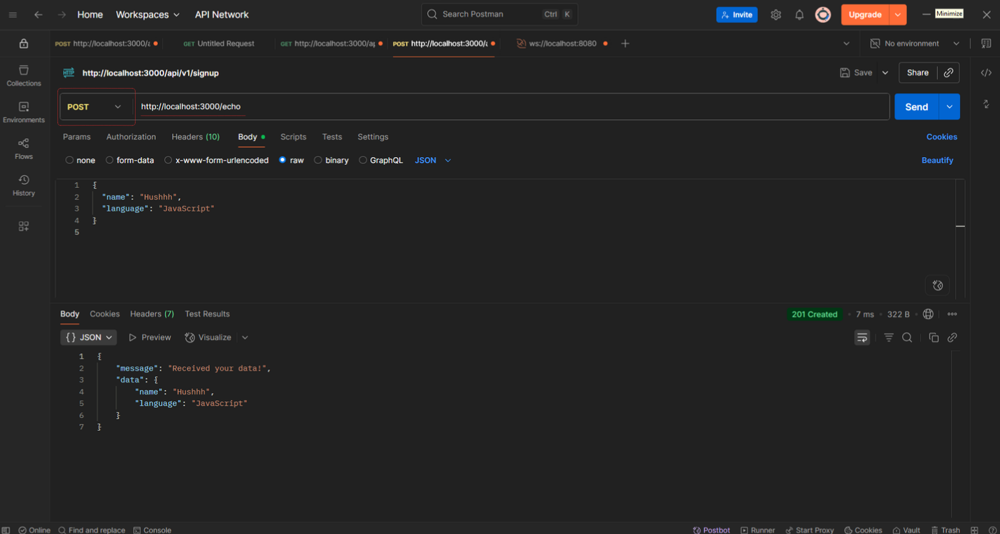

# Day 2 – HTTP, Requests & Responses

Welcome to Day 2 of the **Backend 101 – 30-day challenge**!
Today, we’re diving into **HTTP**, the protocol that connects clients (like browsers or mobile apps) with servers.
You'll also learn to test API endpoints using **Postman**.

---

## Table of Contents
1. [Theory](#theory)
2. [Setup Instructions](#setup-instructions)
3. [Hands-On: Create and Test an API Endpoint](#hands-on-create-and-test-an-api-endpoint)
4. [Bonus Challenges](#bonus-challenges)
5. [What You Learned](#what-you-learned)
6. [Resources](#resources)

---

## Theory

### What is HTTP?
**HTTP (HyperText Transfer Protocol)** is the foundation of communication on the web.
It defines how **clients** (browsers, apps, Postman) send **requests** to servers and how servers **respond** with data.

---

### Anatomy of an HTTP Request
An HTTP request consists of:

| Part    | Description                                      |
|---------|--------------------------------------------------|
| Method  | What you want to do (`GET`, `POST`, `PUT`, etc.) |
| URL     | The address you're sending the request to         |
| Headers | Metadata (e.g. content-type, auth tokens)         |
| Body    | Payload sent with the request (for `POST`, `PUT`) |

---

### Common HTTP Methods

| Method | Use Case                 | CRUD Equivalent |
|--------|--------------------------|-----------------|
| GET    | Fetch data               | Read            |
| POST   | Submit new data          | Create          |
| PUT    | Update an entire resource| Update          |
| PATCH  | Update part of a resource| Update          |
| DELETE | Delete a resource        | Delete          |

---

### HTTP Status Codes

| Code | Meaning                   | Example                            |
|------|---------------------------|------------------------------------|
| 200  | OK                        | Success                            |
| 201  | Created                   | Resource successfully created      |
| 400  | Bad Request               | Missing or invalid data            |
| 401  | Unauthorized              | Not logged in                      |
| 403  | Forbidden                 | No permission                      |
| 404  | Not Found                 | Resource doesn’t exist             |
| 500  | Internal Server Error     | Something broke on the server      |

Knowing how to **read and return** proper HTTP status codes is essential to becoming a solid backend developer.

---

## Setup Instructions

Continue from your Day 1 project or create a new folder:

```bash
mkdir day-02-http-basics
cd day-02-http-basics
npm init -y
npm install express
```

Create a file named `index.js`:

```js
const express = require('express');
const app = express();

// Middleware to parse JSON in POST requests
app.use(express.json());

// GET /hello
app.get('/hello', (req, res) => {
  res.send('Hello from GET!');
});

// POST /echo
app.post('/echo', (req, res) => {
  const data = req.body;
  res.status(201).json({
    message: 'Received your data!',
    data,
  });
});

const PORT = 3000;
app.listen(PORT, () => {
  console.log(`Server running at http://localhost:${PORT}`);
});
```

---

## Hands-On: Create and Test an API Endpoint

Start your server:

```bash
node index.js
```

Test with Postman:

### GET /hello

- **Method:** GET
- **URL:** http://localhost:3000/hello

Expected Response:

```
Hello from GET!
```

### POST /echo

- **Method:** POST
- **URL:** http://localhost:3000/echo
- **Body (JSON):**

```json
{
  "name": "Hushhh",
  "language": "JavaScript"
}
```

Expected Response:

```json
{
  "message": "Received your data!",
  "data": {
    "name": "Hushhh",
    "language": "JavaScript"
  }
}
```

#### Example Postman Screenshots
Add your screenshots to an `./assets/` folder and display them like this:

#### GET /hello


#### POST /echo


---

## Bonus Challenges

**1. Add a custom status code:**
- Return 201 Created when new data is posted (already done in `/echo`).

**2. Return different status codes for different cases:**

```js
app.post('/validate', (req, res) => {
  const { username } = req.body;
  if (!username) {
    return res.status(400).json({ error: 'Username is required' });
  }
  res.status(200).json({ message: `Welcome, ${username}` });
});
```

**3. Explore headers in Postman:**
- Inspect and customize request headers
- Try sending custom headers

**4. Add a response header from server:**

```js
app.get('/headers', (req, res) => {
  res.setHeader('x-powered-by', 'Backend101');
  res.send('Custom header sent.');
});
```

---

## What You Learned

- What HTTP is and how it powers APIs
- Anatomy of an HTTP request and response
- HTTP methods (GET, POST) and status codes (200, 201, 400, etc.)
- How to:
  - Set up and test GET and POST endpoints
  - Return status codes
  - Parse request bodies in Express

---

## Resources

- [MDN – HTTP Overview](https://developer.mozilla.org/en-US/docs/Web/HTTP/Overview)
- [Postman Learning Center](https://learning.postman.com/)
- [Express.js Response Object](https://expressjs.com/en/4x/api.html#res)
- [HTTP Status Codes (Rest API)](https://restfulapi.net/http-status-codes/)

