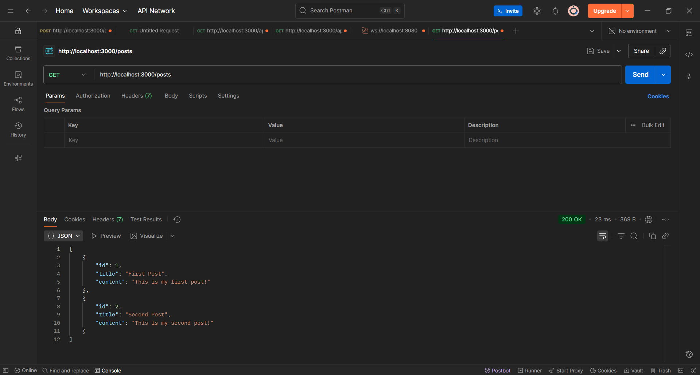
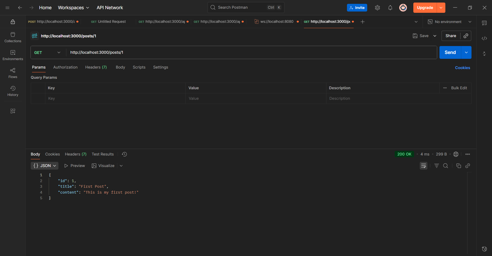
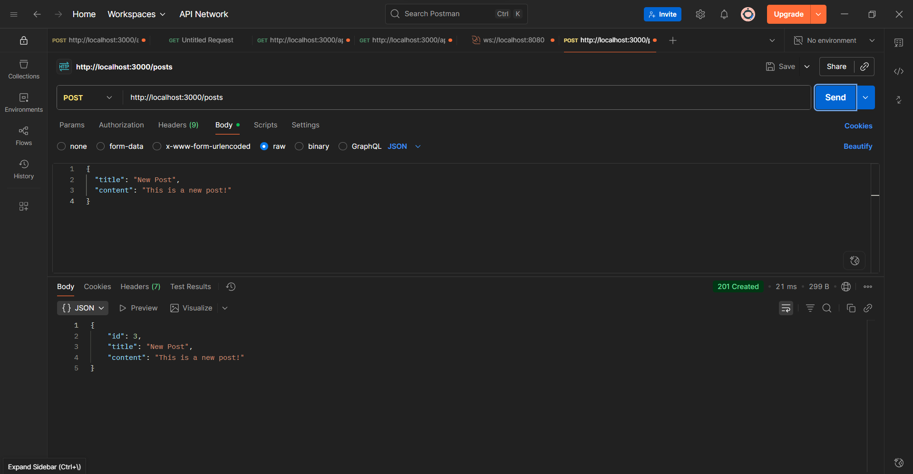
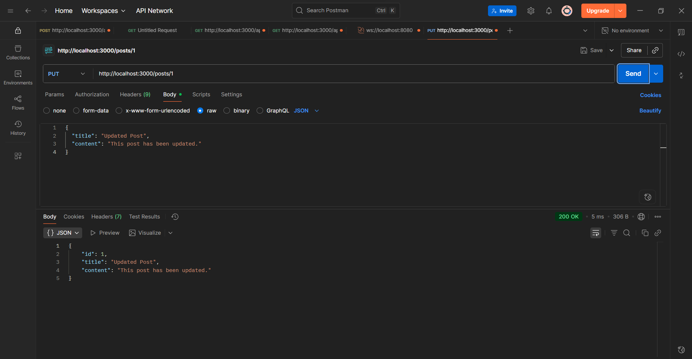
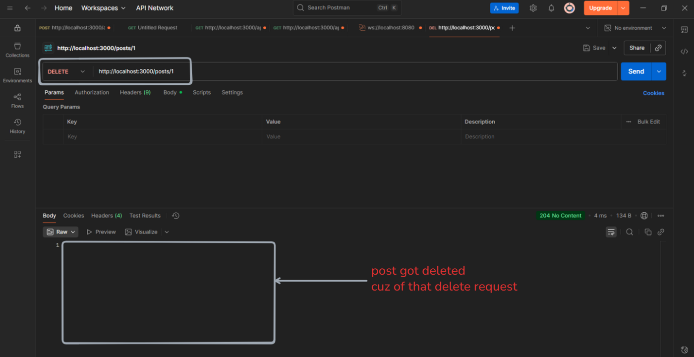

# Day 3 – Introduction to RESTful APIs

Welcome to Day 3 of the **Backend 101 – 30-day challenge**!
Today, we dive into RESTful APIs, the most popular way of structuring and interacting with backend data. You’ll learn the essential CRUD operations (Create, Read, Update, Delete) and implement them with Express.js.

---

## Table of Contents
1. [Theory](#theory)
2. [Setup Instructions](#setup-instructions)
3. [Hands-On: Build a CRUD API](#hands-on-build-a-crud-api)
4. [Bonus Challenges](#bonus-challenges)
5. [What You Learned](#what-you-learned)
6. [Resources](#resources)

---

## Theory

### What is a RESTful API?
REST stands for Representational State Transfer. It’s an architectural style that uses a stateless, client-server communication model to build web services.

RESTful APIs follow these principles:
- **Stateless:** Each request from the client to the server must contain all the information the server needs to process it.
- **Client-Server Architecture:** The client and server are separate entities; the server handles the logic and data, while the client focuses on the user interface.
- **CRUD Operations:** REST APIs typically map the four CRUD operations (Create, Read, Update, Delete) to HTTP methods (POST, GET, PUT, DELETE).

### CRUD Operations & HTTP Methods
- **Create:** POST
- **Read:** GET
- **Update:** PUT
- **Delete:** DELETE

### HTTP Status Codes
Common status codes when building RESTful APIs:
- **200 OK:** The request was successful.
- **201 Created:** The resource was successfully created.
- **400 Bad Request:** The request was invalid.
- **404 Not Found:** The resource was not found.
- **500 Internal Server Error:** An error occurred on the server.

---

## Setup Instructions

### Prerequisites
- Node.js installed (v18+ recommended)
- Express.js installed
- A code editor (e.g., VS Code)

### Step 1: Initialize Your Project
Create a new project folder (or continue from Day 2 project):

```bash
mkdir day-03-restful-api
cd day-03-restful-api
npm init -y
npm install express
```

### Step 2: Build Your CRUD API
Create a new file named `index.js` and write the following code:

```js
const express = require('express');
const app = express();

// Middleware to parse JSON bodies
app.use(express.json());

// In-memory database (for simplicity)
let posts = [
  { id: 1, title: 'First Post', content: 'This is my first post!' },
  { id: 2, title: 'Second Post', content: 'This is my second post!' },
];

// GET: Fetch all posts
app.get('/posts', (req, res) => {
  res.status(200).json(posts);
});

// GET: Fetch a post by ID
app.get('/posts/:id', (req, res) => {
  const post = posts.find(p => p.id === parseInt(req.params.id));
  if (!post) return res.status(404).json({ error: 'Post not found' });
  res.status(200).json(post);
});

// POST: Create a new post
app.post('/posts', (req, res) => {
  const { title, content } = req.body;
  const newPost = { id: posts.length + 1, title, content };
  posts.push(newPost);
  res.status(201).json(newPost);
});

// PUT: Update a post by ID
app.put('/posts/:id', (req, res) => {
  const { title, content } = req.body;
  const post = posts.find(p => p.id === parseInt(req.params.id));
  if (!post) return res.status(404).json({ error: 'Post not found' });
  post.title = title || post.title;
  post.content = content || post.content;
  res.status(200).json(post);
});

// DELETE: Delete a post by ID
app.delete('/posts/:id', (req, res) => {
  const postIndex = posts.findIndex(p => p.id === parseInt(req.params.id));
  if (postIndex === -1) return res.status(404).json({ error: 'Post not found' });
  posts.splice(postIndex, 1);
  res.status(204).send();
});

const PORT = 3000;
app.listen(PORT, () => {
  console.log(`Server running at http://localhost:${PORT}`);
});
```

### Step 3: Start Your Server
Run the server with the following command:

```bash
node index.js
```

You should see:

```
Server running at http://localhost:3000
```

---

## Hands-On: Build and Test Your CRUD API

Test your API using Postman or curl


### GET /posts – Retrieve all posts
- **Method:** GET
- **URL:** http://localhost:3000/posts
- **Expected Response:** A list of posts in JSON format.




### GET /posts/:id – Retrieve a post by ID
- **Method:** GET
- **URL:** http://localhost:3000/posts/1
- **Expected Response:** The post with the given ID.




### POST /posts – Create a new post
- **Method:** POST
- **URL:** http://localhost:3000/posts
- **Body (JSON):**

```json
{
  "title": "New Post",
  "content": "This is a new post!"
}
```

- **Expected Response:** The newly created post with an ID.




### PUT /posts/:id – Update an existing post
- **Method:** PUT
- **URL:** http://localhost:3000/posts/1
- **Body (JSON):**

```json
{
  "title": "Updated Post",
  "content": "This post has been updated."
}
```

- **Expected Response:** The updated post.




### DELETE /posts/:id – Delete a post
- **Method:** DELETE
- **URL:** http://localhost:3000/posts/1
- **Expected Response:** HTTP status code 204 (No Content).



---

## Bonus Challenges

Push yourself further with these bonus challenges:

**1. Validate Data:** Before creating or updating posts, ensure that both title and content are provided. Return a 400 Bad Request if either is missing.

**2. Custom Error Handling:** Create a custom error handler to catch invalid routes (e.g., any route that’s not /posts or /posts/:id).

**3. Search by Title:** Modify the GET /posts route to allow clients to filter posts by title (e.g., GET /posts?title=first).

**4. Handle Empty Arrays:** When no posts exist in the database, return a 404 Not Found with a message saying "No posts available."

---

## What You Learned

- What RESTful APIs are and their purpose.
- The essential CRUD operations and how they map to HTTP methods (GET, POST, PUT, DELETE).
- How to build a basic REST API with Express.js.
- The importance of HTTP status codes for communicating API responses.
- How to test your API with Postman or curl.

---

## Resources

- [MDN: HTTP Overview](https://developer.mozilla.org/en-US/docs/Web/HTTP/Overview)
- [Express.js Documentation](https://expressjs.com/)
- [REST API Tutorial](https://restfulapi.net/)
- [HTTP Status Codes](https://restfulapi.net/http-status-codes/)