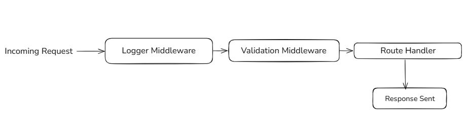

# Day 4: Web Frameworks and Routing

Welcome to Day 4 of the Backend 101 – 30-day challenge! Today, you’ll explore web frameworks and routing, the backbone of backend application structure. You’ll learn how to define routes, use middleware, handle parameters, and organize your code with Express.js. By the end, you’ll be able to build robust APIs and understand how requests flow through your server.

---

### Table of Contents
1. [What is a Web Framework?](#what-is-a-web-framework)
2. [Routing in Express](#routing-in-express)
3. [Route Parameters](#route-parameters)
4. [Middleware in Express](#middleware-in-express)
5. [Hands-On](#hands-on)
6. [Visual Flow](#visual-flow)
7. [Goal](#goal)
8. [Bonus Challenges](#bonus-challenges)
9. [What You Learned](#what-you-learned)
10. [Additional Resources](#additional-resources)

---

## Theory

### What is a Web Framework?
A web framework is a set of tools and libraries that simplifies the process of building server-side applications. It provides features such as:

- **Routing:** Mapping URLs and HTTP methods to functions
- **Middleware:** Processing requests and responses before or after reaching your route logic
- **Parsing and Formatting:** Reading incoming data, formatting outgoing responses
- **Error Handling:** Returning structured and consistent errors

**Common frameworks:**
- Node.js: Express.js, NestJS
- Python: Flask, Django

In this project, we use **Express.js** — a minimal and flexible Node.js framework that’s widely used and great for learning.

### Routing in Express
Routing determines how the server responds to specific HTTP requests.

```js
app.get('/users', handler);     // Retrieve users
app.post('/users', handler);    // Create user
app.get('/users/:id', handler); // Get user by ID
```

#### Route Parameters
Route parameters allow you to handle dynamic URLs:

```js
app.get('/users/:id', (req, res) => {
  const id = req.params.id;
  res.send(`User ID: ${id}`);
});
```

#### Query Parameters
These are passed via the URL like `/search?term=nodejs` and accessed via `req.query`:

```js
app.get('/search', (req, res) => {
  const term = req.query.term;
  res.send(`Searching for: ${term}`);
});
```

### Middleware in Express
Middleware functions sit between the request and the final response. They can:

- Log, validate, or transform the request
- Attach data to the `req` or `res` object
- Control the flow using `next()`

```js
function logger(req, res, next) {
  console.log(`${req.method} ${req.url}`);
  next(); // Pass control to next middleware or route
}

app.use(logger);
```

**Built-in middleware:**

```js
app.use(express.json()); // Parses JSON body and adds it to req.body
```

### Visual Flow


---

## Hands-On

### 1. Setup Routes and Middleware
```js
const express = require('express');
const app = express();
const PORT = 3000;

app.use(express.json()); // JSON parser middleware

// Logger middleware
function timeLogger(req, res, next) {
  console.log(`[${new Date().toISOString()}] ${req.method} ${req.url}`);
  next();
}
app.use(timeLogger);

// Content-Type validator (can be global or route-specific)
function requireJson(req, res, next) {
  if ((req.method === 'POST' || req.method === 'PUT') &&
      req.headers['content-type'] !== 'application/json') {
    return res.status(400).json({ error: 'Content-Type must be application/json' });
  }
  next();
}

// Routes
app.get('/welcome', (req, res) => {
  res.send('Welcome to the backend!');
});

app.post('/echo', requireJson, (req, res) => {
  res.status(201).json({
    message: 'Received your data',
    data: req.body
  });
});

app.get('/users/:id', (req, res) => {
  const userId = req.params.id;
  res.send(`You requested user with ID: ${userId}`);
});
```

### 2. Optional: Group Routes Using express.Router()
```js
const userRouter = express.Router();

userRouter.get('/', (req, res) => res.send('User list'));
userRouter.get('/:id', (req, res) => res.send(`User ID: ${req.params.id}`));

app.use('/users', userRouter);
```

### 3. Add 404 Route Handler
This should always be last, after all route declarations.

```js
app.use((req, res) => {
  res.status(404).json({ error: 'Route not found' });
});
```

---

## Goal
By completing this section, you should be able to:

- Define and structure multiple HTTP routes
- Work with route and query parameters
- Write and apply both built-in and custom middleware
- Organize routes using modular structure
- Gracefully handle unknown routes with a 404 handler

---


## Bonus Challenges
Apply what you’ve learned by extending the server functionality:

- Add a `PUT /users/:id` route that simulates updating a user.
- Add a validator middleware that checks if the `name` field exists in the body for POST/PUT routes.
- Create a `/status` route that returns uptime in seconds:

```js
app.get('/status', (req, res) => {
  res.json({ uptime: process.uptime() });
});
```

---

## What You Learned

By the end of this session, you should understand:

- What a web framework is and why it simplifies backend development
- How routing works in Express and how to define multiple routes
- The use of route parameters for dynamic URLs
- How middleware functions work and how to write custom middleware
- How to validate request data (e.g., checking Content-Type headers)
- How to handle unknown routes with a 404 fallback
- How requests flow through middleware and route handlers

---

## Additional Resources

- [Express.js Documentation](https://expressjs.com/)
- [MDN: Express - Routing](https://developer.mozilla.org/en-US/docs/Learn/Server-side/Express_Nodejs/routes)
- [MDN: HTTP Request Methods](https://developer.mozilla.org/en-US/docs/Web/HTTP/Methods)
- [Node.js Middleware Overview](https://expressjs.com/en/guide/using-middleware.html)
- [REST API Design Tutorial](https://restfulapi.net/)