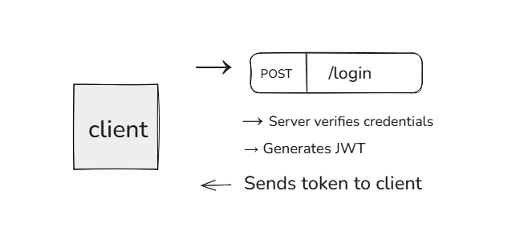
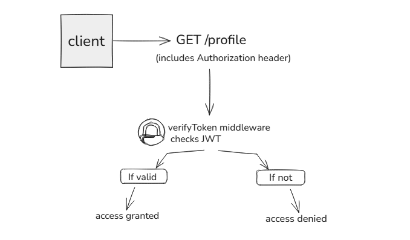

# Day 6: Authentication Basics

Welcome to Day 6 of the Backend 101 30-day challenge!
Today you'll explore how authentication works, how apps verify who you are and keep your data safe. You'll learn about sessions, JWT tokens, and how to implement basic authentication in an Express API.

By the end, you will have built a mini login system with password hashing and token protection.

---

## Table of Contents
1. [What is Authentication?](#what-is-authentication)
2. [Types of Authentication](#types-of-authentication)
3. [Sessions vs JWTs](#sessions-vs-jwts)
4. [Hands-On: Basic Login System](#hands-on-basic-login-system)
5. [Middleware for Protected Routes](#middleware-for-protected-routes)
6. [Visual Flow](#visual-flow)
7. [Goal](#goal)
8. [Bonus Challenges](#bonus-challenges)
9. [What You Learned](#what-you-learned)
10. [Additional Resources](#additional-resources)

---


## What is Authentication?

Authentication is the process of verifying a user's identity. It answers the question: "Who are you?" It typically comes before authorization, which determines "What can you access?"

**Why is authentication important?**
- Protects sensitive data and resources from unauthorized access
- Enables personalized user experiences
- Forms the foundation for security in any application

**Common authentication methods:**
- Password-based login (email/username and password)
- API keys sent in request headers
- Biometric scans (fingerprint, face recognition)
- OAuth and third-party logins (Google, Facebook)

**Authentication vs Authorization:**
- Authentication: Verifies identity
- Authorization: Determines permissions

---
### Deep Dive: Theory of Authentication

Authentication is a critical part of application security. It ensures that only legitimate users can access protected resources. The process typically involves:

1. **Credential Submission:** The user provides credentials (e.g., username and password).
2. **Credential Verification:** The backend checks these credentials against stored records. Passwords should always be hashed and salted before storage to prevent leaks if the database is compromised.
3. **Session or Token Issuance:** If credentials are valid, the backend issues a session (server-side) or a token (client-side, e.g., JWT) to the client. This session/token is used for subsequent requests to prove identity.
4. **Continuous Verification:** For every protected request, the backend verifies the session or token. If valid, the request proceeds; if not, access is denied.

**Risks and Best Practices:**
- Never store plain text passwords. Always hash and salt them.
- Use HTTPS to encrypt data in transit.
- Limit failed login attempts to prevent brute-force attacks.
- Use environment variables to store secrets (e.g., JWT secret).
- Regularly update and rotate secrets.

**Modern Authentication Trends:**
- Multi-factor authentication (MFA) adds layers of security.
- OAuth and SSO allow users to authenticate via trusted third parties.
- Passwordless authentication (magic links, biometrics) is gaining popularity for usability and security.

---

## Types of Authentication

**Session-Based Authentication**
- Server creates a session (in memory or database)
- Client stores a session ID in a cookie
- Each request includes the cookie
- Common in traditional web apps

**Token-Based Authentication (JWT)**
- Server returns a signed token (such as JWT) after login
- Client stores it (localStorage, memory, etc.)
- Token is sent with each request in headers
- Preferred in REST APIs and mobile apps

**Multi-Factor Authentication (MFA)**
- Requires two or more verification methods (password + OTP, etc.)
- Adds an extra layer of security

**Other authentication methods:**
- OAuth: Delegates authentication to third-party providers (Google, Facebook)
- SSO (Single Sign-On): Allows users to log in once and access multiple applications

---

## Sessions vs JWTs

| Feature    | Sessions (Server-side)         | JWTs (Client-side)           |
|------------|-------------------------------|------------------------------|
| Storage    | Server-side                   | Client-side                  |
| Scalability| Needs session store (Redis, DB)| Stateless, easier to scale   |
| Security   | Less exposed to interception   | Token can be stolen (must expire) |
| Use Case   | Web apps                      | APIs, SPAs, mobile apps      |

---

## Hands-On: Basic Login System (Express + JWT)

We'll build a simple authentication API using:
- `jsonwebtoken` for JWT creation/verification
- `bcryptjs` for password hashing

**Step 1: Install Dependencies**
```bash
npm install express jsonwebtoken bcryptjs dotenv
```

**Step 2: Create auth-demo.js**
```js
const express = require('express');
const jwt = require('jsonwebtoken');
const bcrypt = require('bcryptjs');
require('dotenv').config();

const app = express();
app.use(express.json());

const users = []; // In-memory user storage
const SECRET_KEY = process.env.JWT_SECRET || "supersecretkey";

// Register
app.post('/register', async (req, res) => {
  const { username, password } = req.body;
  if (!username || !password)
    return res.status(400).json({ error: "Username and password required" });

  const hashed = await bcrypt.hash(password, 10);
  users.push({ username, password: hashed });
  res.status(201).json({ message: "User registered" });
});

// Login
app.post('/login', async (req, res) => {
  const { username, password } = req.body;
  const user = users.find(u => u.username === username);
  if (!user) return res.status(401).json({ error: "User not found" });

  const valid = await bcrypt.compare(password, user.password);
  if (!valid) return res.status(401).json({ error: "Invalid credentials" });

  const token = jwt.sign({ username }, SECRET_KEY, { expiresIn: '1h' });
  res.json({ token });
});

// Auth Middleware
function verifyToken(req, res, next) {
  const authHeader = req.headers['authorization'];
  const token = authHeader?.split(' ')[1];
  if (!token) return res.status(403).json({ error: "Token required" });

  jwt.verify(token, SECRET_KEY, (err, user) => {
    if (err) return res.status(403).json({ error: "Invalid token" });
    req.user = user;
    next();
  });
}

// Protected Route
app.get('/profile', verifyToken, (req, res) => {
  res.json({ message: `Welcome, ${req.user.username}!` });
});

app.listen(3000, () => console.log("Auth API running on http://localhost:3000"));
```

---

## Middleware for Protected Routes

Middlewares act as checkpoints that inspect requests before they hit your main route.

**Example:**
```js
app.get('/dashboard', verifyToken, (req, res) => {
  res.json({ message: "Protected dashboard", user: req.user });
});
```

If the token is missing or invalid, the user will receive an error before reaching the route logic.

---

## Visual Flow

**Login Flow:**


**Access Protected Route:**


---

## Goal

By the end of this session, you should be able to:
- Understand how authentication works in backend systems
- Create a simple register/login system
- Hash passwords using bcrypt
- Generate and verify JWTs
- Use middleware to secure routes

---

## Bonus Challenges

- Store users in a real database (e.g., SQLite or MongoDB)
- Add a logout system (JWT invalidation or client-side deletion)
- Use .env to hide secrets (JWT_SECRET)
- Add token expiration and refresh logic
- Add user roles (admin, user) and protect routes based on role

---

## What You Learned

- What authentication is and why it matters
- Differences between session and token-based authentication
- How to hash passwords securely
- How to implement a login system using JWT
- How to secure routes using middleware

---

## Additional Resources

- [JWT.io Debugger](https://jwt.io/)
- [bcrypt.js Docs](https://github.com/dcodeIO/bcrypt.js)
- [Express Middleware Docs](https://expressjs.com/en/guide/using-middleware.html)
- [MDN: HTTP Authentication](https://developer.mozilla.org/en-US/docs/Web/HTTP/Authentication)