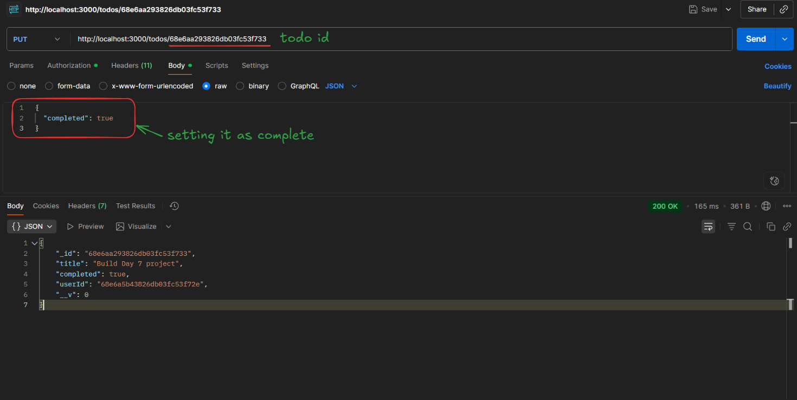

# Day 7: Recap and Mini Project

Welcome to Day 7 of the Backend 101 30-day challenge.
Today you will review the key concepts from the first week, then build a compact project that ties together routing, database operations, and authentication.

By the end, you will have a working backend app (To-Do API) that supports user registration, login, and CRUD operations on to-dos.

---

## Table of Contents

1. [Recap: Key Concepts](#recap-key-concepts)
2. [Project Overview](#project-overview)
3. [Data Models](#data-models)
4. [Setup and Folder Structure](#setup-and-folder-structure)
5. [Routes, Controllers, Middleware](#routes-controllers-middleware)
6. [Visual Flow](#visual-flow)
7. [Goal](#goal)
8. [Bonus Challenges](#bonus-challenges)
9. [What You Learned](#what-you-learned)
10. [Additional Resources](#additional-resources)

---

## Recap: Key Concepts

Here are the main ideas you've covered so far:

* HTTP & REST: methods, status codes, query and route parameters
* Routing & Middleware: mounting routers, request preprocessing
* Databases: relational (SQL) and NoSQL, CRUD operations
* Authentication: hashing passwords, issuing tokens (JWT), route protection
* Error handling: catching errors, sending consistent responses

Make sure you feel comfortable with each. If not, revisit those earlier lessons.

---

## Project Overview

You will build a **To-Do API** that includes:

* User registration and login
* JWT-based authentication
* Protected routes for to-do operations
* Create, read, update, and delete to-do items
* Data validation and error handling

All parts should integrate: routes, controllers, models, middleware.

---

## Data Models

Here are the entities and fields your backend will manage:

### User

* `username` (string, unique)
* `password` (string, stored after hashing)

### Todo

* `title` (string)
* `description` (string, optional)
* `completed` (boolean, default false)
* `userId` (reference to the user)

---

## Setup and Folder Structure
```text
todo-app/
├── server.js
├── db.js
├── .env
├── routes/
│   ├── auth.js
│   └── todos.js
├── controllers/
│   ├── authController.js
│   └── todoController.js
├── models/
│   ├── User.js
│   └── Todo.js
├── middlewares/
│   ├── authMiddleware.js
│   └── errorHandler.js
├── utils/
│   └── asyncHandler.js
└── package.json
```

- `server.js` for application setup and mounting routes
- `db.js` for database connection
- `routes/` for endpoint definitions
- `controllers/` for business logic
- `models/` for schema definitions
- `middlewares/` for auth and error handling
- `utils/` for helper functions

---

## Routes, Controllers, Middleware

### Auth Routes & Controller

**routes/auth.js**

```js
const express = require('express');
const router = express.Router();
const authController = require('../controllers/authController');

router.post('/register', authController.register);
router.post('/login', authController.login);

module.exports = router;
```

**controllers/authController.js**

```js
const User = require('../models/User');
const bcrypt = require('bcryptjs');
const jwt = require('jsonwebtoken');

exports.register = async (req, res, next) => {
  const { username, password } = req.body;
  if (!username || !password) {
    return res.status(400).json({ error: 'Username and password required' });
  }
  const existing = await User.findOne({ username });
  if (existing) {
    return res.status(409).json({ error: 'Username taken' });
  }
  const hashed = await bcrypt.hash(password, 10);
  const user = await User.create({ username, password: hashed });
  res.status(201).json({ message: 'User created', userId: user._id });
};

exports.login = async (req, res, next) => {
  const { username, password } = req.body;
  const user = await User.findOne({ username });
  if (!user) {
    return res.status(401).json({ error: 'Invalid credentials' });
  }
  const valid = await bcrypt.compare(password, user.password);
  if (!valid) {
    return res.status(401).json({ error: 'Invalid credentials' });
  }
  const token = jwt.sign(
    { userId: user._id, username: user.username },
    process.env.JWT_SECRET,
    { expiresIn: '1h' }
  );
  res.json({ token });
};
```

### Auth Middleware

**middlewares/authMiddleware.js**

```js
const jwt = require('jsonwebtoken');

module.exports = (req, res, next) => {
  const authHeader = req.headers.authorization;
  if (!authHeader) {
    return res.status(401).json({ error: 'Authorization header missing' });
  }
  const parts = authHeader.split(' ');
  if (parts.length !== 2 || parts[0] !== 'Bearer') {
    return res.status(401).json({ error: 'Invalid Authorization format' });
  }
  const token = parts[1];
  jwt.verify(token, process.env.JWT_SECRET, (err, payload) => {
    if (err) {
      return res.status(403).json({ error: 'Invalid or expired token' });
    }
    req.user = { id: payload.userId, username: payload.username };
    next();
  });
};
```

### To-Do Routes & Controller

**routes/todos.js**

```js
const express = require('express');
const router = express.Router();
const todoController = require('../controllers/todoController');
const authMiddleware = require('../middlewares/authMiddleware');

router.use(authMiddleware);

router.get('/', todoController.getAll);
router.post('/', todoController.create);
router.get('/:id', todoController.getOne);
router.put('/:id', todoController.update);
router.delete('/:id', todoController.remove);

module.exports = router;
```

**controllers/todoController.js**

```js
const Todo = require('../models/Todo');

exports.getAll = async (req, res) => {
  const todos = await Todo.find({ userId: req.user.id });
  res.json(todos);
};

exports.create = async (req, res) => {
  const { title, description } = req.body;
  if (!title) {
    return res.status(400).json({ error: 'Title is required' });
  }
  const todo = await Todo.create({
    title,
    description,
    userId: req.user.id
  });
  res.status(201).json(todo);
};

exports.getOne = async (req, res) => {
  const todo = await Todo.findOne({
    _id: req.params.id,
    userId: req.user.id
  });
  if (!todo) {
    return res.status(404).json({ error: 'To-do not found' });
  }
  res.json(todo);
};

exports.update = async (req, res) => {
  const updated = await Todo.findOneAndUpdate(
    { _id: req.params.id, userId: req.user.id },
    req.body,
    { new: true }
  );
  if (!updated) {
    return res.status(404).json({ error: 'To-do not found' });
  }
  res.json(updated);
};

exports.remove = async (req, res) => {
  const deleted = await Todo.findOneAndDelete({
    _id: req.params.id,
    userId: req.user.id
  });
  if (!deleted) {
    return res.status(404).json({ error: 'To-do not found' });
  }
  res.json({ message: 'Deleted successfully' });
};
```

---

## Visual Flow

**Authentication Flow**

Client → POST `/auth/login` with credentials
→ verify credentials → issue JWT → return token

**Protected To-Do Flow**

Client → GET/POST/PUT/DELETE `/todos` (with `Authorization: Bearer <token>`)
→ `authMiddleware` verifies token → controller handles DB operations → response

---

## Actions Performed

### 1. Registering a New User
- **Action:**
  - Send a POST `/auth/register` request with username and password
- **Request Body:**
  ```json
  {
    "username": "hushhh",
    "password": "123456"
  }
  ```
- **Expected Response:**
  ```json
  { "message": "User created", "userId": "..." }
  ```
  **Registering a New User:**

    
### 2. Logging In to Get a Token
- **Action:**
  - Send a POST `/auth/login` request with the same credentials
- **Expected Response:**
  ```json
  { "token": "eyJhbGciOi..." }
  ```
  **Token response in Postman:**
  
  

### 3. Using the Token in Protected Route
- **Action:**
  - Send a GET `/todos` request with the token in the Authorization header:
    ```
    Authorization: Bearer <your_token>
    ```
- **Expected Response:**
  ```json
  []
  ```
  **Token added in Authorization header:**

  

### 4. Creating a To-Do Item
- **Action:**
  - Send a POST `/todos` request with a new task
- **Request Body:**
  ```json
  {
    "title": "Build Day 7 project"
  }
  ```
- **Expected Response:**
  ```json
  {
    "_id": "...",
    "title": "Build Day 7 project",
    "completed": false,
    "userId": "..."
  }
  ```
  **Task creation in Postman:**

  

### 5. Viewing To-Do Items Again
- **Action:**
  - Send a GET `/todos` again (with token)
- **Expected Response:**
  ```json
  [
    {
      "_id": "...",
      "title": "Build Day 7 project",
      "completed": false,
      "userId": "..."
    }
  ]
  ```
  **To-do list with new task:**

 

### 6. Updating a Task
- **Action:**
  - Send a PUT `/todos/:id` to update completed status
- **Request Body:**
  ```json
  {
    "completed": true
  }
  ```
- **Expected Response:**
  ```json
  {
    "_id": "...",
    "title": "Build Day 7 project",
    "completed": true,
    "userId": "..."
  }
  ```
  **Marking task as completed:**

  

### 7. Deleting a Task
- **Action:**
  - Send a DELETE `/todos/:id` (with token)
- **Expected Response:**
  ```json
  { "message": "Deleted successfully" }
  ```
  **Deleting a to-do item:**

  

### 8. Accessing Protected Route Without Token
- **Action:**
  - Send a GET `/todos` without Authorization header
- **Expected Response:**
  ```json
  { "error": "Authorization header missing" }
  ```
  **Error response without token:**

  
---
## Goal

By the end of Day 7 you should be able to:

* Bring together everything from Week 1 into a single project
* Build a backend app with user authentication and CRUD operations
* Secure routes and manage data access per user
* Structure the code into routes, controllers, models, and middleware

---

## Bonus Challenges

* Add input validation (e.g. express-validator)
* Add filtering, pagination, sorting to `/todos`
* Implement `PATCH /todos/:id` for partial updates
* Add roles (e.g. “admin”) and protect routes accordingly
* Implement logout or token refresh endpoints
* Write tests for your endpoints
* Deploy the backend on a platform (Heroku, Railway, etc.)

---

## What You Learned

* How to assemble routing, authentication, and database logic into a cohesive app
* How to protect endpoints with JWTs
* How to structure backend projects in a modular, maintainable way
* How to handle errors and validation across your app

---

## Additional Resources

- [Express.js official documentation](https://expressjs.com/)
- [JWT Introduction (jwt.io)](https://jwt.io/introduction/)
- [Mongoose (MongoDB ORM) docs](https://mongoosejs.com/docs/guide.html)
- [express-validator documentation](https://express-validator.github.io/docs/)
