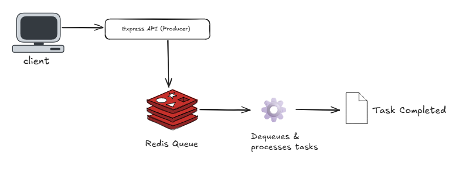

# Day 17: Queues and Task Scheduling

Welcome to Day 17 of the Backend 101 30-day challenge.
Today’s topic is task queues, a powerful way to offload time-consuming work from your main server to improve performance and scalability.

By the end of this lesson, you’ll understand why queues matter, how to set up a Redis-backed queue, and how to process background jobs like sending emails or processing images.

---

## Table of Contents

1. [Introduction](#introduction)
2. [Why Use Task Queues](#why-use-task-queues)
3. [How Queues Work](#how-queues-work)
4. [Popular Queue Tools](#popular-queue-tools)
5. [Hands-on: Setting Up a Queue](#hands-on-setting-up-a-queue)
6. [Practice Tasks](#practice-tasks)
7. [Bonus Challenges](#bonus-challenges)
8. [Common Mistakes](#common-mistakes)
9. [What You Learned](#what-you-learned)
10. [Further Reading](#further-reading)

---

## Introduction

Imagine your app sends a welcome email every time a new user signs up.
If the email is sent inside the signup request, the user has to wait until the email is finished sending before getting a response.
This slows down the user experience and can lead to timeout errors.

Task queues solve this by moving heavy work to the background. Your server responds to the user immediately, while a separate worker handles the job asynchronously.

## Why Use Task Queues

Queues are useful when:

- A task is time-consuming (for example, sending emails, processing images, generating reports)
- You want to improve response times
- You need retry mechanisms if something fails
- You want to schedule tasks at a specific time or interval

Without queues: Your main server does everything, increasing latency.
With queues: Your main server offloads tasks, keeping it responsive.

## How Queues Work

A typical queue system has three parts:

- **Producer:** Your app pushes a job into the queue (for example, “Send welcome email to user@example.com”).
- **Broker:** A system like Redis stores these jobs in a queue.
- **Worker:** A separate process listens for jobs and executes them.



This decouples your application logic from time-heavy tasks.

## Popular Queue Tools

| Language | Library | Description |
|---|---|---|
| Node.js | Bull / BullMQ | Fast, Redis-based queue |
| Node.js | Agenda | MongoDB-based job scheduler |
| Go | Asynq | Redis-based task queue for Go |

For this lesson, we’ll use Bull with Redis in Node.js.

## Hands-on: Setting Up a Queue (Node.js + Bull)

### 1. Install Redis

You need Redis running locally or in Docker.

**macOS (Homebrew):**
```sh
brew install redis
brew services start redis
```

**Or with Docker:**
```sh
docker run -d -p 6379:6379 redis
```

### 2. Install Dependencies
```sh
npm install bull express nodemailer @bull-board/express
```

### 3. Create a Queue

`queue.js`

```js
const Queue = require('bull');
const emailQueue = new Queue('emailQueue', 'redis://127.0.0.1:6379');

module.exports = emailQueue;
```

### 4. Add Jobs (Producer)

`server.js`

```js
const express = require('express');
const emailQueue = require('./queue');

const app = express();
app.use(express.json());

app.post('/register', async (req, res) => {
  const { email } = req.body;

  console.log(`User registered: ${email}`);

  await emailQueue.add(
    { email },
    { attempts: 3, backoff: 5000 } // retry on failure
  );

  res.send({ message: 'User registered. Welcome email will be sent shortly.' });
});

app.listen(3000, () => console.log('Server running on port 3000'));
```

### 5. Process Jobs (Worker)

`worker.js`

```js
const emailQueue = require('./queue');
const nodemailer = require('nodemailer');

const transporter = nodemailer.createTransport({
  jsonTransport: true
});

emailQueue.process(async (job) => {
  try {
    console.log(`Sending welcome email to ${job.data.email}`);

    await transporter.sendMail({
      from: 'noreply@example.com',
      to: job.data.email,
      subject: 'Welcome',
      text: 'Thank you for registering'
    });

    console.log(`Email sent to ${job.data.email}`);
  } catch (err) {
    console.error(`Failed to send email to ${job.data.email}`, err);
    throw err; // allows Bull to retry
  }
});
```

### 6. Optional: Bull Board UI

`monitor.js`

```js
const { ExpressAdapter } = require('@bull-board/express');
const { createBullBoard } = require('@bull-board/api');
const { BullAdapter } = require('@bull-board/api/bullAdapter');
const emailQueue = require('./queue');
const express = require('express');

const serverAdapter = new ExpressAdapter();
createBullBoard({
  queues: [new BullAdapter(emailQueue)],
  serverAdapter,
});

serverAdapter.setBasePath('/admin/queues');

const app = express();
app.use('/admin/queues', serverAdapter.getRouter());
app.listen(3001, () => console.log('Bull Board running on http://localhost:3001/admin/queues'));
```

This allows you to see all jobs visually in your browser.

### 7. Run the System

Open three terminals:

```sh
node worker.js
node server.js
node monitor.js
```

Test the queue:

```sh
curl -X POST http://localhost:3000/register \
  -H "Content-Type: application/json" \
  -d '{"email": "test@example.com"}'
```

You will see the email job processed in the worker logs and Bull Board.

## Practice Tasks

- Add retry logic if the email job fails.
- Add a delay (for example, send the email 5 seconds later).
- Schedule a recurring job (for example, daily report).
- Add error handling and logging for failed jobs.
- Explore Bull Board to visualize your queues.

## Bonus Challenges

- Use BullMQ with advanced features like priorities and job states.
- Implement a retry strategy with exponential backoff.
- Run multiple workers to simulate horizontal scaling.
- Add a cron job using Bull’s repeatable jobs.
- Deploy Redis in the cloud and connect to it from your local app.

## Common Mistakes

- Forgetting to run Redis (jobs will stay pending).
- Not handling errors in the worker (crashes the process).
- Doing heavy work in the producer instead of the worker.
- Using a single process for both producer and worker in production.

## What You Learned

By completing Day 17, you can now:

- Explain why task queues are essential for scalable backends
- Understand the Producer–Queue–Worker architecture
- Set up Redis and Bull to handle background jobs
- Use retries and error handling in workers
- Visualize jobs with Bull Board
- Build more efficient backend systems

## Further Reading

- [Bull Queue Docs](https://github.com/OptimalBits/bull)
- [BullMQ](https://docs.bullmq.io/)
- [Agenda.js](https://github.com/agenda/agenda)
- [Redis Official Docs](https://redis.io/docs/)
- [Nodemailer](https://nodemailer.com/)
- [Bull Board](https://github.com/felixmosh/bull-board)