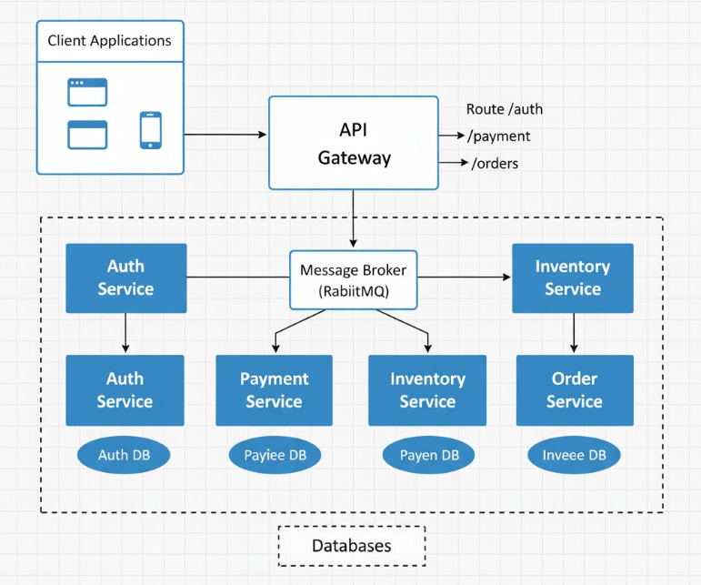
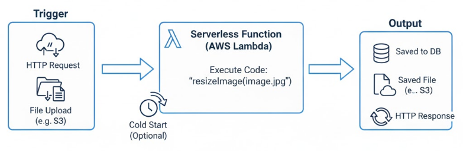

# Day 18: Microservices and Serverless Architectures

Welcome to Day 18 of the Backend 101 30-day challenge. Today you will explore two common architectural patterns used to build scalable systems: microservices and serverless.

By the end of this session, you will understand how microservices differ from monolithic applications, how serverless functions work, and when to use each pattern.

This session builds on earlier concepts like asynchronous processing (Day 16), queues (Day 17), and reverse proxies (Day 15).

---

## Table of Contents

1. [Introduction](#introduction)
2. [What Are Microservices](#what-are-microservices)
3. [Monolith vs Microservices](#monolith-vs-microservices)
4. [Introduction to Serverless](#introduction-to-serverless)
5. [Microservices vs Serverless](#microservices-vs-serverless)
6. [When to Use What](#when-to-use-what)
7. [Clarifying Key Concepts](#clarifying-key-concepts)
8. [Hands-on Tasks](#hands-on-tasks)
9. [Bonus Challenges](#bonus-challenges)
10. [Quick Quiz](#quick-quiz-reflection)
11. [What You Learned](#what-you-learned)
12. [Further Reading](#further-reading)

---

## Introduction

As applications grow, managing them as a single codebase becomes harder. Monoliths can become difficult to scale, update, or deploy. Microservices and serverless offer two different solutions by dividing your system into smaller components that are easier to manage and scale.

## What Are Microservices


Microservices are independent, focused services that handle a specific business function within a larger system. Each service has its own codebase and can be deployed separately.

**Example:** An e-commerce platform might have separate services for authentication, payment, and inventory.

<p align="center">
  
</p>

**Advantages:**
- Independent deployment and scaling
- Smaller, maintainable codebases
- Each service can use a different language or tech stack

**Challenges:**
- More complex communication between services
- Requires monitoring, logging, and deployment tooling
- Higher operational overhead than a monolith

## Monolith vs Microservices

| Feature      | Monolith                  | Microservices                      |
|-------------|---------------------------|------------------------------------|
| Codebase    | Single codebase           | Multiple independent codebases     |
| Deployment  | One deploy process        | Deploy each service independently  |
| Scaling     | Scale the entire app      | Scale only the services you need   |
| Technology  | One language/framework    | Each service can use a different stack |
| Simplicity  | Easier to start           | More setup and coordination needed |

## Introduction to Serverless


Serverless functions are small, stateless pieces of code triggered by events such as HTTP requests or file uploads. They are hosted by cloud providers who manage the infrastructure, scaling, and execution.

<p align="center">
  
</p>

**Common providers:**
- AWS Lambda
- Google Cloud Functions
- Vercel / Netlify Functions

**Typical use cases:**
- Sending emails on form submission
- Image resizing on upload
- Running scheduled cleanup tasks

**Advantages:**
- No infrastructure to manage
- Scales automatically with demand
- Pay only for time used

**Limitations:**
- Shorter execution limits
- Cold start latency
- Stateless by default

## Microservices vs Serverless

| Feature         | Microservices                | Serverless                      |
|-----------------|-----------------------------|---------------------------------|
| Granularity     | Service-level               | Function-level                  |
| Deployment      | Docker, servers, containers | Deployed as cloud functions     |
| Resource Control| Full control over runtime   | Limited config options          |
| Cost Model      | Ongoing server or container cost | Pay-per-invocation         |
| Use Case        | Stateful or long-running processes | Lightweight, short-lived tasks |

## When to Use What

**Use microservices when:**
- You have long-running or complex logic
- You need control over environment or runtime
- Services need to maintain some form of internal state

**Use serverless when:**
- Tasks are triggered by events
- You prefer not to handle server setup, scaling, or updates
- The workload is lightweight and can run within execution time limits

_Often, a hybrid approach works best: core features in microservices, utility tasks in serverless functions._

## Clarifying Key Concepts

**Cold Start Latency**

A cold start is the time delay when a serverless function is triggered for the first time or after a period of inactivity. The platform needs to initialize the function before running it, which can take a few hundred milliseconds or more.

**Stateless**

Serverless functions do not retain data between invocations. Each call starts with no memory of past executions. You must use external storage (databases, caches) to persist data between requests.

## Hands-on Tasks

### 1. Break a Feature into a Microservice

Take a feature from a previous project and extract it as a standalone service. For example:
- Notification service that sends emails or logs messages
- Auth service for login and token validation

**Steps:**
- Create a new Express or Flask app
- Run it on a different port (e.g., 4000)
- From your main app, send a request to this service using fetch or axios
- Optional: Add Nginx to route `/api/notify` to the notification service.

_Note: If you're new to Docker or Nginx, consider following a beginner tutorial before diving in._

### 2. Deploy a Serverless Function

Choose a platform (Vercel, Netlify, or AWS Lambda) and write a basic function.

**Example (Node.js on Vercel):**

```js
export default function handler(req, res) {
  const { name } = req.query;
  res.status(200).json({ message: `Hello, ${name}` });
}
```

Deploy and test the URL. You can trigger this function with a curl request or in the browser.

For AWS Lambda, refer to the [AWS Lambda Getting Started Guide](https://docs.aws.amazon.com/lambda/latest/dg/getting-started.html). It may involve IAM setup, deployment via ZIP or CLI, and configuring triggers.

## Bonus Challenges

- Containerize a microservice using Docker
- Set up Nginx to route traffic between multiple services
- Schedule a serverless function to run daily (e.g., cleanup task)
- Compare cold start time between AWS and Vercel
- Use a queue (like Bull) to trigger a serverless job asynchronously

## Quick Quiz / Reflection

- What is one advantage of using microservices?
- When would serverless not be a good choice?
- What tool can you use to route traffic to different microservices?
- What is a cold start and why can it be an issue?
- How would you store persistent data in a stateless function?

_Try answering these before moving on to the next day._

## What You Learned

By the end of Day 18, you should be able to:

- Explain the core differences between monoliths, microservices, and serverless
- Identify suitable use cases for each approach
- Deploy a basic microservice and communicate with it via HTTP
- Write and test a simple serverless function
- Understand how serverless execution works, including cold starts and stateless behavior

## Further Reading

- [Microservices.io by Chris Richardson](https://microservices.io/)
- [AWS Lambda Documentation](https://docs.aws.amazon.com/lambda/latest/dg/welcome.html)
- [Serverless Handbook by Swizec Teller](https://serverlesshandbook.dev/)
- [Vercel Serverless Docs](https://vercel.com/docs/functions)
- [Martin Fowler: Microservices](https://martinfowler.com/articles/microservices.html)